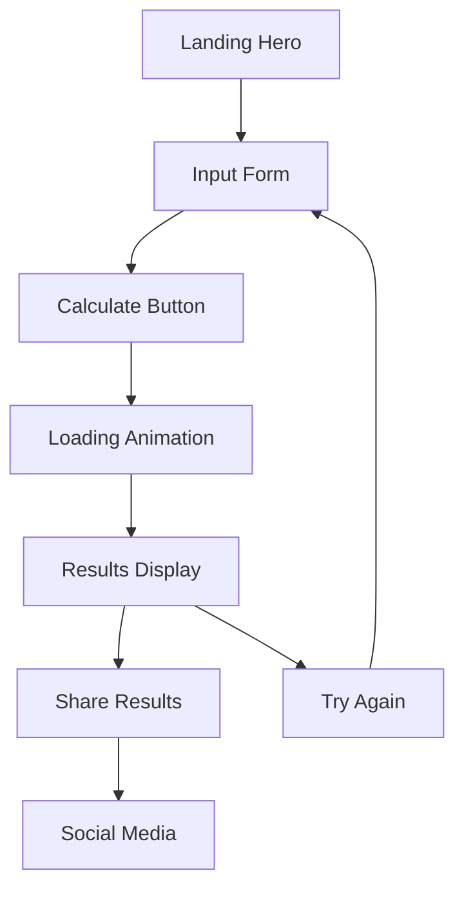

# Predikta - Love Meter Web Application

## 1. Product Overview

**Predikta** adalah aplikasi web Love Meter yang menggabungkan desain UI brutalism dengan pengalaman interaktif yang menarik untuk mengukur kompatibilitas cinta antara dua orang.

Aplikasi ini dirancang sebagai showcase kreatifitas desain UI/UX dengan gaya brutalism yang bold, raw, dan unconventional, memberikan pengalaman visual yang eye-catching dan modern. Target utama adalah menciptakan aplikasi single-page yang memorable dan viral-worthy untuk demonstrasi keahlian desain dan development.

## 2. Core Features

### 2.1 User Roles
Tidak diperlukan sistem role yang kompleks - semua pengguna memiliki akses yang sama ke fitur Love Meter.

### 2.2 Feature Module

Aplikasi Predikta terdiri dari satu halaman utama dengan beberapa modul interaktif:

1. **Landing Section**: Hero area dengan branding Predikta, tagline menarik, dan call-to-action
2. **Love Meter Calculator**: Form input nama dan tanggal lahir, algoritma kalkulasi kompatibilitas
3. **Results Display**: Animasi hasil dengan persentase love meter, deskripsi kompatibilitas
4. **Interactive Elements**: Animasi hover, particle effects, sound effects (optional)

### 2.3 Page Details

| Page Name | Module Name | Feature description |
|-----------|-------------|---------------------|
| Main Page | Hero Section | Display bold Predikta branding dengan typography brutalism, animated tagline "Discover Your Love Compatibility", gradient background dengan geometric shapes |
| Main Page | Input Form | Collect nama pasangan 1 & 2, tanggal lahir (optional), gender selection dengan brutalist button design, real-time validation |
| Main Page | Love Meter Engine | Calculate compatibility berdasarkan algoritma nama dan tanggal lahir, generate random seed untuk konsistensi hasil, display loading animation dengan progress bar |
| Main Page | Results Display | Show percentage dengan large brutalist typography, animated circular progress meter, compatibility description dengan emoji, share buttons untuk social media |
| Main Page | Interactive Effects | Particle animation background, hover effects pada buttons, sound feedback (click sounds), responsive micro-interactions |
| Main Page | Footer Section | Credits, social links, "Try Again" button dengan brutalist styling |

## 3. Core Process

**Main User Flow:**
1. User membuka aplikasi Predikta
2. User melihat hero section dengan branding dan call-to-action
3. User mengisi form dengan nama kedua pasangan
4. User mengklik tombol "Calculate Love" 
5. Sistem menampilkan loading animation
6. Hasil kompatibilitas ditampilkan dengan animasi
7. User dapat share hasil atau mencoba lagi

## 4. User Interface Design

### 4.1 Design Style

**Brutalism UI Elements:**
- **Primary Colors**: Electric Blue (#0066FF), Neon Pink (#FF0066), Pure Black (#000000), Pure White (#FFFFFF)
- **Secondary Colors**: Lime Green (#00FF66), Orange (#FF6600), Purple (#6600FF)
- **Typography**: Bold sans-serif fonts (Inter Black, Helvetica Bold), oversized headings, high contrast text
- **Button Style**: Chunky rectangular buttons dengan sharp corners, high contrast colors, bold borders (3-4px)
- **Layout Style**: Asymmetrical grid, overlapping elements, raw geometric shapes, intentional "broken" layouts
- **Animation Style**: Sharp, mechanical movements, glitch effects, sudden transitions
- **Icons**: Geometric shapes, pixel-art style, high contrast monochrome icons

### 4.2 Page Design Overview

| Page Name | Module Name | UI Elements |
|-----------|-------------|-------------|
| Main Page | Hero Section | Oversized "PREDIKTA" title dengan glitch effect, neon gradient background, floating geometric shapes, brutalist tagline dengan typewriter animation |
| Main Page | Input Form | Chunky input fields dengan thick borders, neon focus states, asymmetrical layout, brutalist labels dengan all-caps typography |
| Main Page | Love Meter | Circular progress dengan neon colors, pixelated heart icons, glitch transition effects, oversized percentage display |
| Main Page | Results Area | High contrast result cards, neon accent colors, geometric pattern backgrounds, brutalist typography hierarchy |
| Main Page | Interactive Elements | Sharp hover animations, color inversion effects, geometric particle system, mechanical sound feedback |

### 4.3 Responsiveness

**Desktop-First Approach:**
- Optimized untuk desktop showcase dengan full-screen experience
- Mobile-adaptive dengan maintained brutalism aesthetic
- Touch-friendly button sizes (minimum 44px)
- Simplified animations pada mobile untuk performance
- Maintained high contrast dan readability across devices