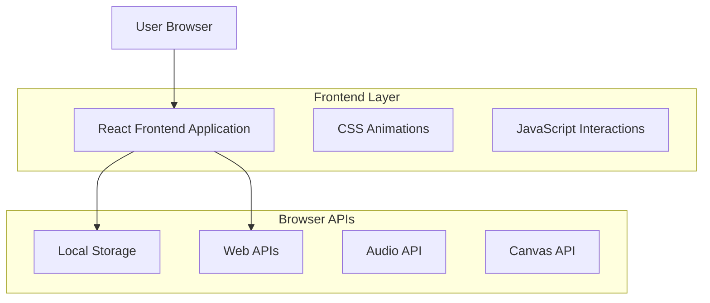

# Predikta - Technical Architecture Document

## 1. Architecture Design



## 2. Technology Description

- **Frontend**: React@18 + TypeScript + Vite + TailwindCSS
- **Styling**: TailwindCSS + Custom CSS untuk brutalism effects
- **Animations**: Framer Motion + CSS Animations
- **Audio**: Web Audio API untuk sound effects
- **Graphics**: Canvas API untuk particle effects
- **Build Tool**: Vite untuk fast development dan optimized builds

## 3. Route Definitions

| Route | Purpose |
|-------|---------|
| / | Main page - Love Meter application dengan semua fitur dalam single page |

## 4. Component Architecture

### 4.1 Core Components

**Main Application Structure:**
```
App
├── HeroSection
├── LoveMeterForm
├── LoadingAnimation
├── ResultsDisplay
├── ParticleBackground
└── Footer
```

### 4.2 State Management

**Local State dengan React Hooks:**
- `useState` untuk form inputs dan UI states
- `useEffect` untuk animations dan side effects
- `useContext` untuk global theme dan settings
- Local Storage untuk menyimpan hasil sebelumnya

## 5. Love Meter Algorithm

### 5.1 Compatibility Calculation

**Algorithm Logic:**
```typescript
interface LoveCalculation {
  name1: string;
  name2: string;
  birthDate1?: string;
  birthDate2?: string;
}

function calculateLoveCompatibility(data: LoveCalculation): number {
  // Kombinasi algoritma berdasarkan:
  // 1. Numerologi nama (character values)
  // 2. Astrologi sederhana (birth dates)
  // 3. Random seed untuk konsistensi
  // Return: percentage 0-100
}
```

### 5.2 Result Categories

**Compatibility Ranges:**
- 90-100%: "Perfect Match! 💕"
- 75-89%: "Great Compatibility! 💖"
- 60-74%: "Good Potential! 💗"
- 45-59%: "Worth Exploring! 💓"
- 30-44%: "Challenging but Possible! 💔"
- 0-29%: "Better as Friends! 💙"

## 6. Data Model

### 6.1 Data Structures

**Love Meter Input:**
```typescript
interface LoveMeterInput {
  partner1: {
    name: string;
    birthDate?: string;
  };
  partner2: {
    name: string;
    birthDate?: string;
  };
  timestamp: Date;
}
```

**Love Meter Result:**
```typescript
interface LoveMeterResult {
  id: string;
  input: LoveMeterInput;
  compatibility: number;
  category: string;
  description: string;
  createdAt: Date;
}
```

### 6.2 Local Storage Schema

**Storage Keys:**
```typescript
// Menyimpan hasil sebelumnya
'predikta_results': LoveMeterResult[]

// User preferences
'predikta_settings': {
  soundEnabled: boolean;
  animationsEnabled: boolean;
  theme: 'default' | 'neon' | 'dark';
}
```

## 7. Performance Optimizations

### 7.1 Frontend Optimizations

- **Code Splitting**: Dynamic imports untuk heavy components
- **Image Optimization**: WebP format dengan fallbacks
- **CSS Optimization**: Critical CSS inlining
- **Animation Performance**: CSS transforms dan GPU acceleration
- **Bundle Size**: Tree shaking dan minification

### 7.2 User Experience

- **Loading States**: Skeleton screens dan progress indicators
- **Error Handling**: Graceful fallbacks untuk failed animations
- **Accessibility**: ARIA labels dan keyboard navigation
- **Progressive Enhancement**: Core functionality tanpa JavaScript